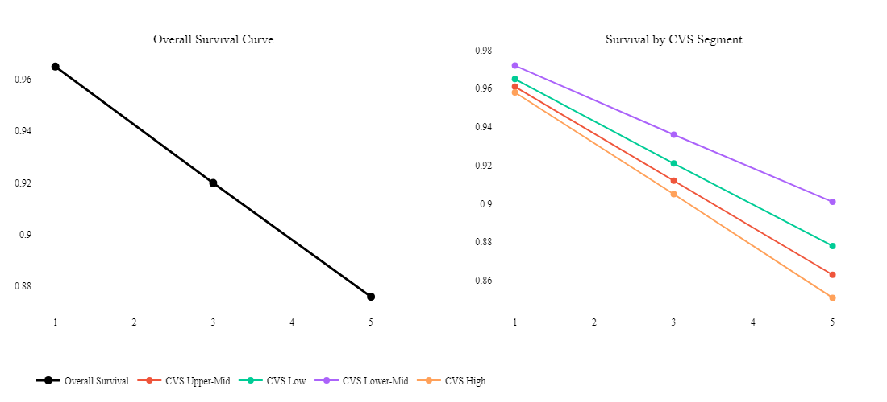
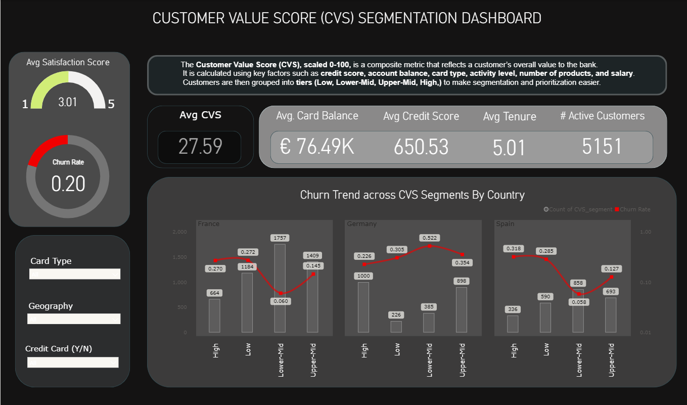

# 🏦 Customer Value Segmentation and Churn Risk Analysis

## 📌 Project Overview
This project combines **Customer Value Scoring (CVS)** with **Survival Analysis** to provide  
a data-driven framework for understanding **which customers are likely to churn, when they might churn,  
and how much they matter to the business if they do**.

- **Who is most valuable to retain?**  
- **When are they most at risk of leaving?**  
- **How do new joiners behave over time?**

---

## 🎯 Business Context
It is far more expensive to acquire new customers than to retain existing ones.  
Banks and financial institutions therefore focus heavily on **customer retention strategies**.  

Traditional churn models only tell you *who might leave*.  
This project goes further by combining churn prediction with **customer value** and **time-to-churn** analysis.

---

## 🛠 Methodology

### 1. Customer Value Score (CVS)
- Features: Credit Score, Balance, Salary, Products, Card Type, Activity.  
- **Step 1:** Normalize financial and engagement features.  
- **Step 2:** Apply **PCA** to derive feature weights (data-driven, not arbitrary).  
- **Step 3:** Compute CVS on a 0–100 scale.  
- **Step 4:** Segment into tiers: High / Upper-Mid / Lower-Mid / Low.

### 2. Survival Analysis
- Model: **Cox Proportional Hazards**.  
- Horizons: **1 year, 3 years, 5 years**.  
- Outputs:
  - Churn probabilities by horizon.  
  - Segment-level survival curves.  
  - Cohort survival for **new joiners**.  

### 3. Deliverables
- **Ranked lists** of at-risk customers by CVS + churn probability.  
- **Segment-level insights** on survival vs churn.  
- **Visual dashboards** (Plotly & Power BI).  

---

## 📊 Key Insights
- Early churn is low: most new customers stay for at least 1 year.  
- By year 5, **High-value customers are more likely to churn than mid-value customers** — counterintuitive but critical.  
- **Lower-Mid customers** show the strongest natural retention (~90% survival at 5 years).  
- Retention strategies should focus **not just on who churns, but on who matters most**.

---

## 📈 Visuals

### Survival Curves (Overall vs CVS Segments)

### Power BI Dashboard (Segmentation View)

---

## 📂 Repository Structure
